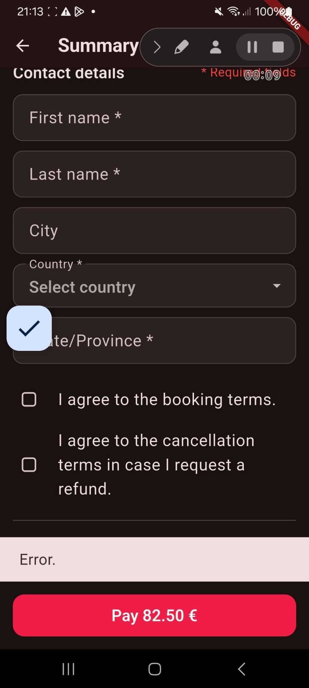
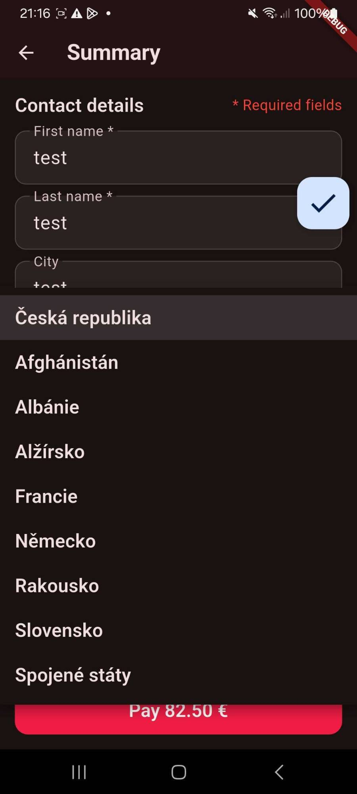
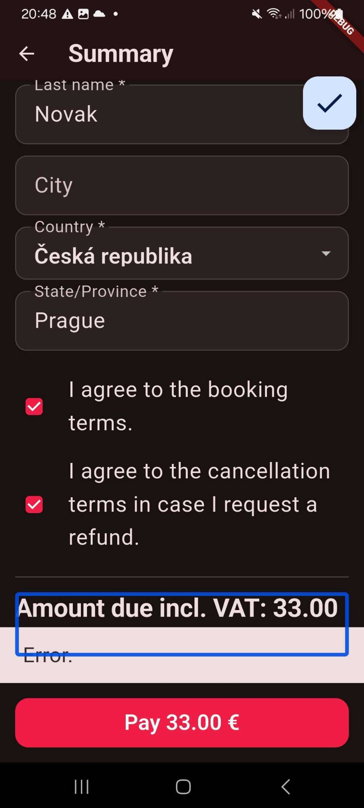
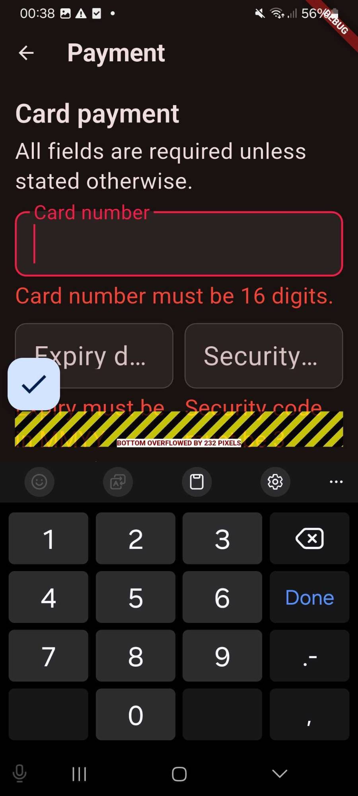
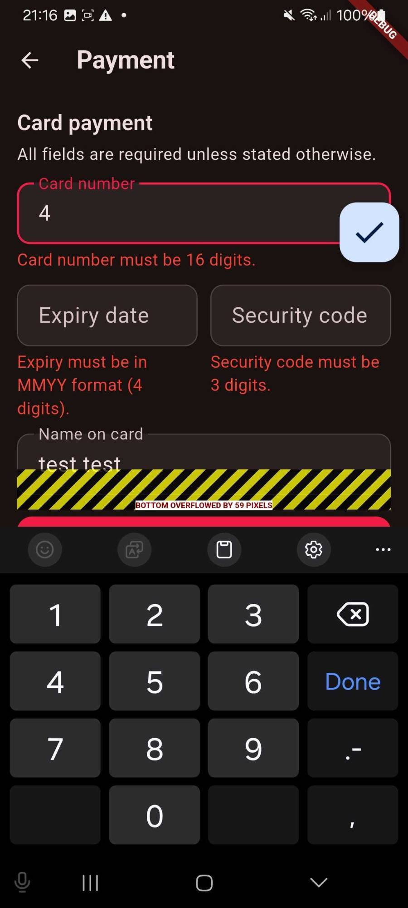
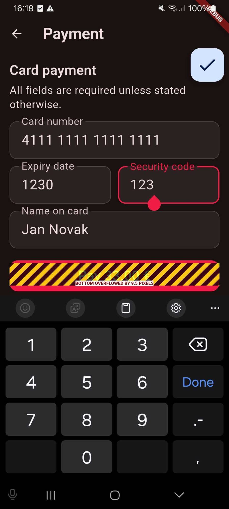

# Findings

Bugs, accessibility gaps, UX notes, and test-authoring tradeoffs found while
writing the Maestro flows.

## Bugs

1. **Promo code field is gated behind a decoy button.** Questions has no
   promo field until you tap "Enter promo" on Checkout — shows a fake
   `Error.`, sets `promoHintUnlocked` (`questions_screen.dart:252`) — then
   go back. Covered by `01_purchase_flow.yaml` (flow 5) and
   `04_promo_code_variations_extra.yaml`.
   
   <video src="media/findings/promo_decoy_error.mp4" controls width="360"></video>

2. **The 4th product's (index 3 in code/ids — Statue of Liberty / Ellis
   Island Ferry Tour) "Edit" button does nothing after confirmation.** Tap
   is a silent no-op — no dialog, no change. Covered by
   `05_product_date_dependencies_extra.yaml`, flow 2. For contrast, product 1
   (Madame Tussauds) still opens its edit dialog fine after confirmation.
   <video src="media/findings/statue_of_liberty_edit_noop.mp4" controls width="360"></video>
   <video src="media/findings/product1_edit_working_for_contrast.mp4" controls width="360"></video>

3. **Language mix: English + Slovak + Czech at once.** Switching to Czech
   on Home leaves the package name in English (`home_screen.dart:71`) and
   translates the rest into Slovak, not Czech (`:94`, `:119`) — but every
   screen after Home (`app_strings.dart`) is correct Czech. Not automated.

4. **Checkout "Country" field stays in Czech even with the app set to
   English.** Contact details on Checkout don't fully respect the English
   locale.
   

5. **A new order code appears on every declined payment retry.** Expected
   one order code per booking across retries; actual is a different code
   per attempt.

6. **A generic error appears repeatedly even when all conditions are met**
   — on the Additional information screen, for example. Also reproduced on
   Checkout: all required fields filled, both terms checkboxes ticked,
   correct total shown — the `Error.` banner still shows. Not yet
   root-caused.
   

7. **Payment screen overflows when validation errors show with the
   keyboard open.** `RenderFlex overflowed by 232 pixels` — the screen body
   (`payment_screen.dart`) is a plain `Column`, no `SingleChildScrollView`.
   Same root cause as the font-scaling overflow below, different trigger.
   Not asserted in a flow (brittle across screen sizes); the validation
   path itself is covered by `02_payment_declined_bonus.yaml`.
   
   
   

8. **Several required-field errors have no dedicated id.** Only
   `Questions_ValidationError` (`booking_ids.dart:56`) has one. Checkout's
   `_RequiredFieldError`/terms-checkbox errors (`checkout_screen.dart:168,
   186,235,253,271,291`) and Questions' `_ErrorText` (`questions_screen.dart:
   139,178,238`) have none. Worked around by asserting on the one error that
   does have an id, plus "still on the same page."

## Accessibility issues

Found by exploring with TalkBack/VoiceOver and font-size scaling, outside
the Maestro flows themselves.

1. **200% font size causes overflow instead of expansion.** Questions
   ("Additional information") is cut off on the right; Payment's bottom
   (extra line + warning) is cut off too — a real Flutter layout bug
   (`RenderFlex` overflow, plain `Column` with no scroll view), not a
   device-scaling artifact.

2. **Error indication is color-only.** No icon/symbol next to required-field
   errors, just colored text — not enough for colorblind/low-vision users.

3. **Screen reader doesn't read the adult/child count on Tickets.**
   TalkBack/VoiceOver skips the count text next to the +/- buttons.

4. **First/last name fields: only the input is accessible, not the label.**
   Screen reader announces the field but not "First name"/"Last name."

Good side: the app doesn't structurally break at large font sizes outside
of the overflow above (no crash, content just gets clipped).

## UX/UI issues

1. **Language toggle shows the next option, not the current selection.**
   Top-right button should reflect the active language, not the one you'd
   switch to.
   

2. **"How will you be arriving" is free text, not preselected options.**
   Free text makes responses hard to aggregate across bookings; preselected
   options (by taxi/on foot/by subway/other) would be more consistent — also
   unclear whether responses are read by a person or a tool at volume.

3. **Continue gives no feedback on why it's blocked.** When a required
   field/checkbox is missing, Continue just doesn't do anything — no
   scroll-to-error, and the "I confirm" checkbox is easy to miss.

4. **Ticket count +/- buttons disable at the cap** — noting for
   completeness; looked correct in testing, flagging in case an edge case
   turns up around exactly 20 combined.
